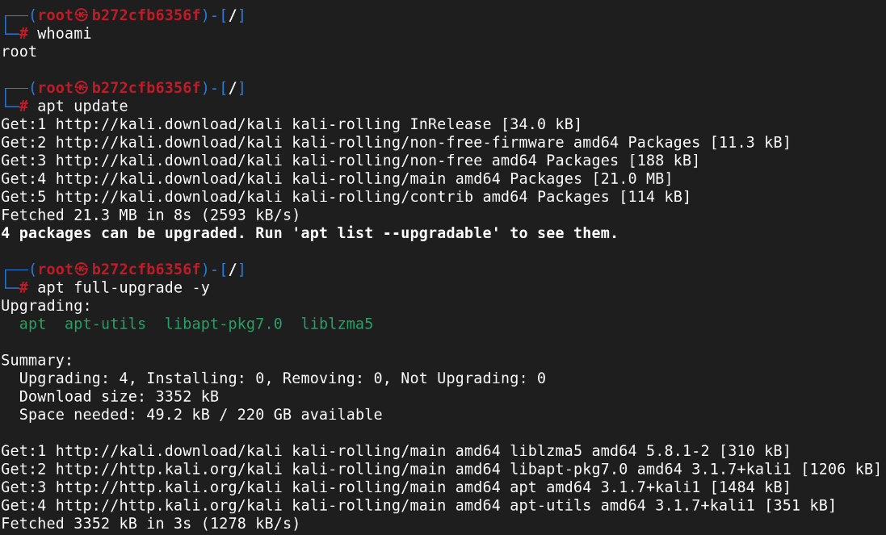
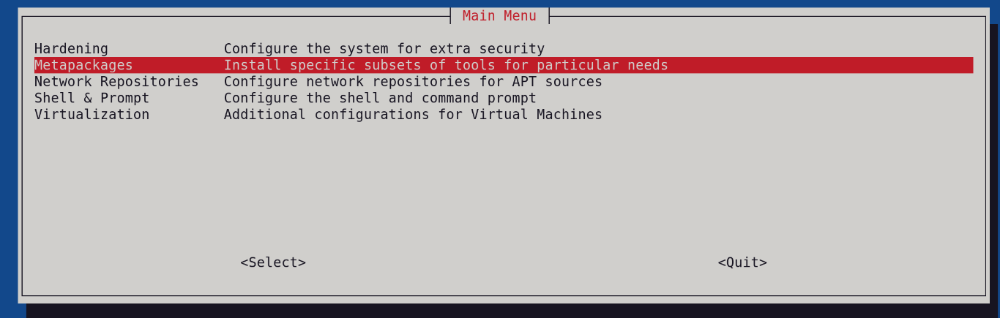
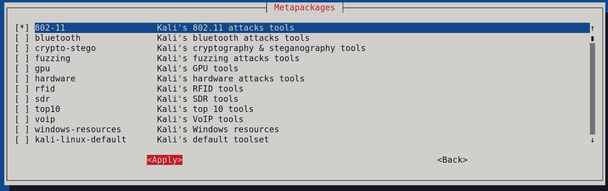
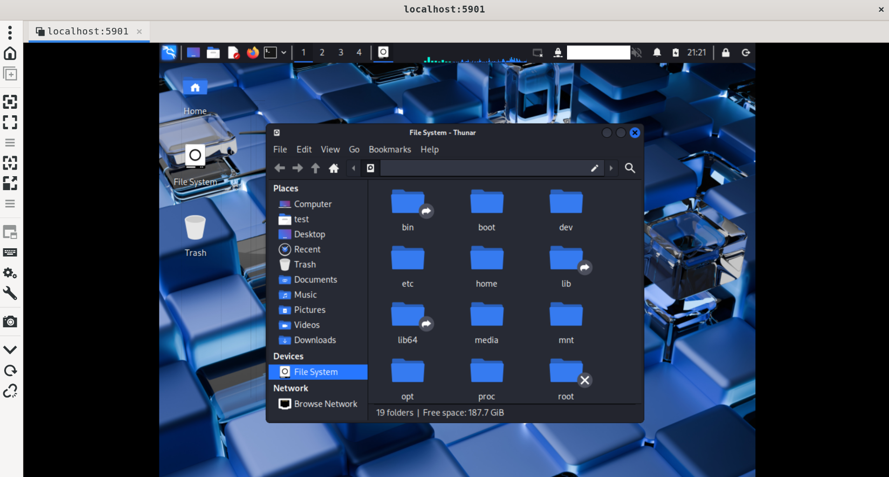

# Podman

### A. Commands I found useful (personally)

   `podman rmi ID` this command is used to remove one or more specific images from local storage.  
   `podman rmi --all or (-a)`  removes all images in local storage  
   `podman prune` cleaning up unused Podman resources  
   `podman images` List all local images   
   `podman ps -a` list running containers on the local machine  
   `podman ps` list the containers on the local system  
   `podman attach [options] <container>` attach to a running container and view its output or control it  


### B. Trying out kali linux on podman from start to end

[Podman](https://docs.podman.io/en/latest/) defined as a daemonless, open source, Linux native tool designed to make it easy to find, run, build, share and deploy applications using Open Containers Initiative (OCI) Containers and Container Images. The containers can be run by root with netavark default n/w which allows a container to have a routable IP address or by a non-privileged user using default network mode of slirp4netns.

#### 1. installing podman

To start of, I'm running Debian GNU/Linux 13 (trixie) x86_64 on bash shell 5.2.37 and GNOME 48.4 as my DE.

- `sudo apt update`
- `sudo apt-get -y install podman` # install package
- `podman --version` # confirm installation


#### 2. installing kali-linux

Head over to [kali](https://www.kali.org/get-kali/#kali-containers) to get the image in shortname, confirm this by checking the **shortnames.conf**  in */etc/containers/registries.conf.d/shortnames.conf*

Mine has, so, onto the next...

- `podman pull kali-rolling` # to get kali image
- `podman run -it -p 5901:5901 kali-rolling` as opposed to `podman run --tty --interactive kali-rolling` to run the container and publish port 5901

> NB: "the images do not come with the “default” metapackage." and "I will need to apt update && apt -y install (your metapackage)." to install my [metapackage](https://www.kali.org/docs/general-use/metapackages/).  
NB: If exited, resume by running `podman ps -a` to get image ID, then `podman start 'ID'` and finally `podman attach 'ID'`

1. I first need to check if am root.

- `whoami` # since am root I can proceed otherwise, continue with sudo

2. then update as recomended.

- `apt update && apt -y install kali-linux-headless` #since we have a [minimal installation](https://www.kali.org/docs/troubleshooting/common-minimum-setup/) 
- `sudo apt update` && `sudo apt full-upgrade -y`



3. Use kali-tweaks to install metapackage groups.

- `apt install kali-tweaks`
- `dpkg -s kali-tweaks` # confirm installation
- `kali-tweaks`

Proceed as follows; I chose 802.11 for Wi-Fi




> #### NB:
> - Important to create a new kali user with no-root privileges as `sudo adduser stnd` and switch with `su stnd` so as to prevent running X applications or a graphical environment as the root user without proper X authority setup; it throws > the error *_"xauth: file /root/.Xauthority does not exist"_*
>  - add the stnd to sudo group by `sudo usermod -aG sudo stnd` in root user mode.
>  - create both the .Xauthority file with `touch /home/stnd/.Xauthority` and `touch /home/stnd/.Xresources` if you get X server configurations file error while loading xrdb.
>  - `ls -la ~ | grep X` confirm the files have been added.

4. install xfce desktop as it's light `sudo apt install -y kali-desktop-xfce`
   > #### NB:
   > ~check if dislplay manager is set and enabled `systemctl get-default` and install either *lightdm* or *gdm3* and finally `systemctl enable` & also    `start gdm3`~
   above is not advisable since the display managers (gdm3/lightdm) expect a physical or virtual TTY and full system init and they don’t have systemd or    [hardware-level display access](https://www.kali.org/get-kali/#kali-containers) which can block or crash thereby preventing VNC’s Xvnc(its own X         session) from starting properly.


5. - Install a **vnc server** with `sudo apt install tightvncserver` (a virtual Network Computing cross-platform screen sharing system created to remotely control another computer) and `export USER="yourusername"` in my case `export USER="stnd"`

   - ```
          :display -The display number to use. If omitted, the next free display number is used.
          -geometry widthxheight - Set desktop width and height.
          -depth depth - Set the colour depth of the visual to provide, in bits per pixel. Must be a value between 8 and 32.
     ```

6. Set a password for remote view with `vncpasswd` and/or one for read only then  run `vncserver`
7. Set `vncserver :1 -geometry 1280x800 -depth 24` for display on the VNC Client (am using [Remmina](https://remmina.org/))
8. - Secure VNC with SSH tunneling to connect across untrusted networks with `ssh -L 5901:localhost:5901 user@container-host
` or `ssh -L 5901:localhost:5901 user@<host_ip>`
   - e.g., if user (use whoami) is stnd and ip is 192.168.0.1 `ssh -L 5901:localhost:5901 stnd@192.168.0.1`

9. Open Remmina and choose VNC, put `localhost:5901` or `192.168.0.1:5901` if secured with ssh and key your password

> #### NB:
   > To view on a windows based laptop, download TightVNC from this [link](https://www.tightvnc.com/download/2.8.85/tightvnc-2.8.85-gpl-setup-64bit.msi).  
   > Get host IP by `ip addr show`  
   > Install the **.msi** and put the ip address with the port number, if :1 put 590**1**
10. Kill the session whe done with `vncserver -kill :1`; to check all opened sessions use `vncserver -list` or `ps -ef | grep (Xvnc/Xtightvnc)` if in minimal container as I am in.




#### Other Documentations of help

i. [Kali: Packages and Binaries](https://www.kali.org/tools/kali-meta/)  
ii. [VNC Server Doc](https://www.commandlinux.com/man-page/man1/vncserver.1.html)
